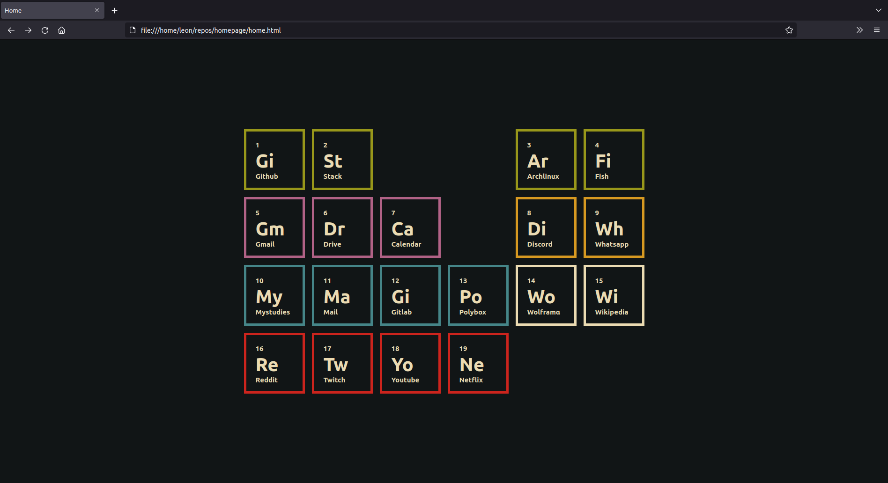

# Homepage



This is my personal homepage and the generator for it.
It's styled after a periodic table with [gruvbox](https://github.com/morhetz/gruvbox) theme and has some simple fade-in animations.

## Generating the home page

To generate the home page you will first need to edit the `content.csv` file.
This file is just a plain CSV file with the first entry being the name, the second being the URL and the third being the category.

E.g.
```
github, www.github.com, dev
gmail, www.gmail.com, personal
...
```

For the category use one of:
* dev
* uni
* personal
* social
* entertainment

Or leave it empty to make the cell white

The first empty line in content.csv will determine how many columns there will be in the periodic table
based on how many lines preceded it.

All the URLs will be prepended with `https://` before being inserted into the template.

You can also use a blank entry with the name `blank`, this will create a invisible chunk to act as spacing.

After you edit `content.csv` you just need to run the python script which will generate a `index.html` file.
Then you can just set the `index.html` file as your home page and you're good to go.
